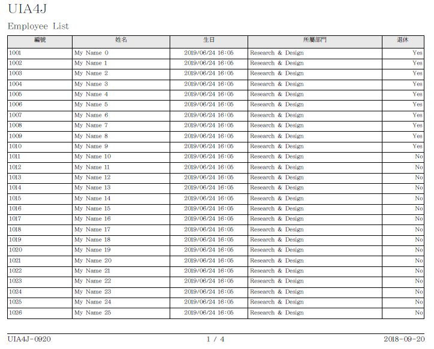
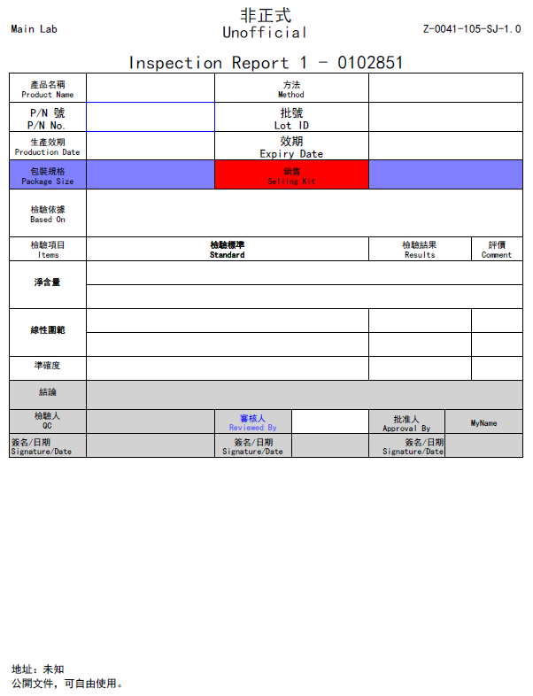

PDF Document Builder
============================

[中文](readme_tw.md), [Design](design_tw.md)

The API uses model data to build PDF files that are rendered in a Grid or GridBag.

PDF files arg generated by [Apache PDFBox](https://pdfbox.apache.org/) framework.

## Description
The basic elements of a document layout includes
* Page Orientation
    * Portrait
    * Landscape
* Conent Veiw
    * Grid Style
    * Gridbag Style
* Description View
    * Header Information
    * Footer Information
* Padding Size
    * Top
    * Bottom
    * Left
    * Right

Schematic diagrams as follow:


## Examples
### Grid Case 1
Source code: __uia.pdf.GridViewTest__

```java
// 1. load layouts for a document
GridViewFactory factory1 = GridViewFactory.fromXml("sample/grid/layout.xml");

// 2. prepare header and footer
SimpleHeaderView header = new SimpleHeaderView("UIA4J", 20);
SimpleFooterView footer = new SimpleFooterView("UIA4J-0920", "2018-09-20", 11);

// 3. new a pdf
PDFMaker pdf = new PDFMaker(FontUtils.traditional());

// 4. add data
GridView view = factory1.mainView(pdf, Paper.A4L, "employee");
view.setHeaderView(header);
view.setFooterView(footer);
view.draw(SampleEmployee.create(), "Employee List", true);

// 5. draw header & footer
header.draw();
footer.draw();

// 6.save
pdf.save(new File("output/grid_case1.pdf"));
```
Output:



### GridBag Case 1
Source code: __uia.pdf.GridBagViewTest__
```java
// 1. load layouts for a document
GridBagFactory factory1 = GridBagFactory.fromXml("sample/gridbag/layout_header_footer.xml");
GridBagFactory factory2 = GridBagFactory.fromXml("sample/gridbag/layout.xml");

// 2. header & footer
GridBagDescriptionView header = factory1.descView("header");
GridBagDescriptionView footer = factory1.descView("footer");

// 3. new a pdf
PDFMaker pdf = new PDFMaker(FontUtils.simplified());

// 4 A4
GridBagView cv1 = factory2.mainView(pdf, Paper.A4);
cv1.setHeaderView(header);
cv1.setFooterView(footer);
cv1.addPage(prepareData1(), "Inspection Report 1", false);
cv1.addPage(prepareData2());
cv1.addPage(prepareData3(), "Inspection Report 2", false);

// 5 A4L
GridBagView cv2 = factory2.mainView(pdf, Paper.A4L);
cv2.setHeaderView(header);
cv2.setFooterView(footer);
cv2.addPage(prepareData1(), "Inspection Report 3", false);
cv2.addPage(prepareData2());
cv2.addPage(prepareData3(), "Inspection Report 4", false);

// 6. draw header & footer
header.draw();
footer.draw();

// 7. save
pdf.save(new File("output/gridbag_case1.pdf"));
```
Output:




## Copyright and License

Licensed under the Apache License, Version 2.0 (the "License");
you may not use this file except in compliance with the License.
You may obtain a copy of the License at

[http://www.apache.org/licenses/LICENSE-2.0](http://www.apache.org/licenses/LICENSE-2.0)

Unless required by applicable law or agreed to in writing, software
distributed under the License is distributed on an "AS IS" BASIS,
WITHOUT WARRANTIES OR CONDITIONS OF ANY KIND, either express or implied.
See the License for the specific language governing permissions and
limitations under the License.
