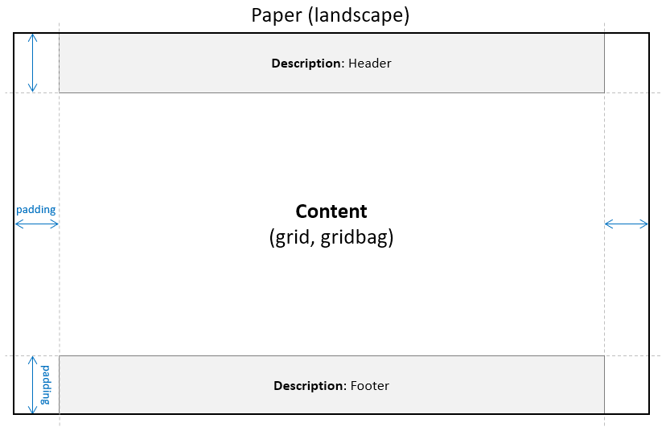

PDF Report API
============================

[Chinese](readme_tw.md)

This API provides methods to create grid-based & gridbag-based PDF document.

## Description
The basic concept of a document layout includes
* Direction
    * Portarit
    * Landscape
* Conent Veiw
    * Grid Style
    * Gridbag Style
* Description View
    * Header Information
    * Footer Information
* Padding Size
    * Top
    * Bottom
    * Left
    * Right

Take a look quickly:




### Grid Style
```java
// 1. load layouts for a document
GridViewFactory factory1 = GridViewFactory.fromXml("sample/grid/layout.xml");

// 2. prepare header and footer
SimpleHeaderView header = new SimpleHeaderView("UIA4J", 20);
SimpleFooterView footer = new SimpleFooterView("UIA4J-0920", "2018-09-20", 11);

// 3. new a pdf
PDFMaker pdf = new PDFMaker(FontUtils.traditional());

// 4. add data
GridView view = factory1.mainView(pdf, Paper.A4L, "employee");
view.setHeaderView(header1);
view.setFooterView(footer);
view.draw(SampleEmployee.create(), "Employee List", true);

// 5. draw header & footer
header.draw();
footer.draw();

// 6.save
pdf.save(new File("output/grid_case1.pdf"));
```

### Gridbag Style
```java
// 1. load layouts for a document
GridBagFactory factory1 = GridBagFactory.fromXml("sample/gridbag/layout_header_footer.xml");
GridBagFactory factory2 = GridBagFactory.fromXml("sample/gridbag/layout.xml");

// 2. header & footer
GridBagDescriptionView header = factory1.descView(pdf, "header");
GridBagDescriptionView footer = factory1.descView(pdf, "footer");

// 3. new a pdf
PDFMaker pdf = new PDFMaker(FontUtils.simplified());

// 4 A4
GridBagView cv1 = factory2.mainView(pdf, Paper.A4);
cv1.setHeaderView(header);
cv1.setFooterView(footer);
cv1.addPage(prepareData1(), "Inspection Report 1", false);
cv1.addPage(prepareData2());
cv1.addPage(prepareData3(), "Inspection Report 2", false);

// 5 A4L
GridBagView cv2 = factory2.mainView(pdf, Paper.A4L);
cv2.setHeaderView(header);
cv2.setFooterView(footer);
cv2.addPage(prepareData1(), "Inspection Report 3", false);
cv2.addPage(prepareData2());
cv2.addPage(prepareData3(), "Inspection Report 4", false);

// 6. draw header & footer
header.draw();
footer.draw();

// 7. save
pdf.save(new File("output/gridbag_case1.pdf"));
```

## Tutorial
- [Tutorial](tutorial.md)
